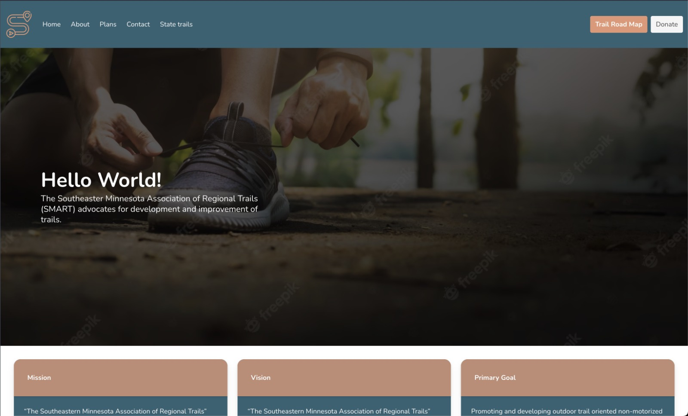

# < smart-trails >

<fig>

<figcaption>The smart-trails website home page</figcaption>
</fig>

# < smart-trails >

## introduction

> This project
> is a redesign of an existing website. The work was commissioned by an American company to the technology students at Riverland College.

It was was built with the intension of making their website look better, since it was developed many years ago.

## Technical Analysis

The system is composed by a web interface built with HTML, CSS and JS. Main Features:

- **F1** - Home page -> Talks a little bit about the company -> Smart. it gives information about their mission, vision and primary goals. It also shows pictures of their trail roads already built.
- **F2** - About page -> Talks about the company itself. What they do, the countries they are based at and describe their trail roads plan.
- **F3** - Contact page -> Let the costumer leave their personal information, so an agent can contact them later.

The tools used to build this system was HTML,the most basic building block of the Web. It defines the meaning and structure of web content. Also, CSS: used to describe a web page's appearance/presentation. And, finally, JavaScript: used to describe a web page's functionality/behavior

### Requirements Gathering

The client asked to use an specific website that already existed on the internet and rebuild it using only HTML/CSS/JS

### Functional Requirements

Respecting what was proposed, the system will attend the following requisites

- **RF1** - Code Legibility.
- **RF2** - Only HTML/CSS/JS.
- **RF3** - Commits.

## Basic concepts

- [JavaScript](https://developer.mozilla.org/en-US/docs/Web/JavaScript)
- [CSS](https://www.w3schools.com/css/)
- [HTML](https://www.w3schools.com/html/)
- [Git](https://git-scm.com/)
